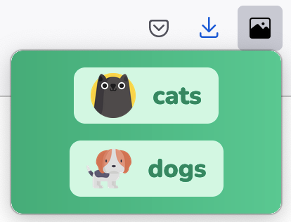

## Popup



## Installation

```
yarn
```

## Cleaning

```
yarn clean
```

This will delete the node_modules folder.


## Development mode

```
yarn start
```

This mode will work in both Chrome and Firefox.


## Attribution

### cat and dog images
<div>Icons made by <a href="https://www.freepik.com" title="Freepik">Freepik</a> from <a href="https://www.flaticon.com/" title="Flaticon">www.flaticon.com</a></div>

## image icon
<div>Icons made by <a href="https://www.flaticon.com/authors/phoenix-group" title="Phoenix Group">Phoenix Group</a> from <a href="https://www.flaticon.com/" title="Flaticon">www.flaticon.com</a></div>